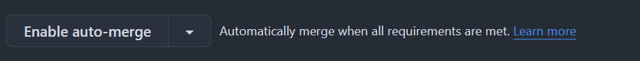

### Default Branch Status

### DEV Branch Status

## このサイトについて
このサイトはMinecraftSurvivalServerのWebサイトです。

## このサイトの貢献方法
> [!NOTE]
> このサイトはGitHub Actionsを使用してビルドされています。
> ただの html+css+js のサイトです。
> node.js20.x, npm が必要です。
>> 22へ移行するかも。

> [!IMPORTANT]
> mainブランチ, DEVブランチは直接編集できません。保護されています。
> DEVブランチから新たにブランチを作成して、そこで編集してください。

編集後、Pull Request (以下、PR) を送ってください。自動で担当者が割り振られます。
必要なレビューとステータスチェックがすべて完了したら、PRは自動的にマージするように設定できます。(おすすめ)

> [!TIP]
> GitHub Actions によって、push, PR時にTyposによるエラー検知が行われます。
> エラーが出た場合は、修正してください。
> チェック対象のファイルは、typos-paths.txt に記載されています。適宜変更してください。
> 
> また、GitHub Actions によって、PR時にmain, DEVブランチにPRしていた場合、CodeQLによるエラー検知が行われます。
>
> Dependabot によって、依存関係の更新が行われます。(npm) 変更は自動的にPRされます。

mainブランチにPR後、自動でデプロイされます。
